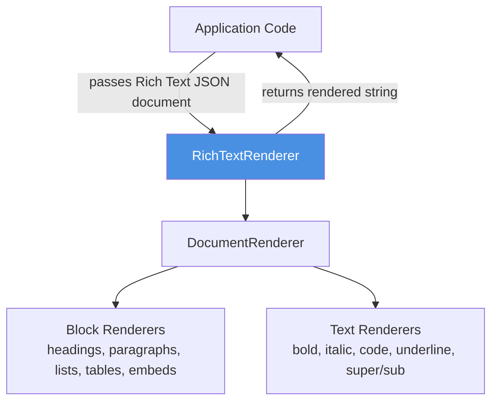

<!-- Generated by seed-golden-context | Last updated: 2026-05-05 -->

# Architecture

## Overview

`rich-text-renderer.py` is a Python library that converts Contentful Rich Text JSON documents into rendered output — HTML by default. It is a presentation-layer companion to the [Contentful Python SDK](https://github.com/contentful/contentful.py): the SDK fetches content, this library renders it. All rendering behavior is overridable per node type, making it usable as a base for any markup target.

## System Context

The library has no runtime dependencies — it operates entirely on the Python standard library and the Rich Text JSON structure returned by the Contentful Delivery API.

## Internal Structure

| Module | Purpose |
|---|---|
| `rich_text_renderer/rich_text_renderer.py` | Entry point — `RichTextRenderer` class, holds the `DEFAULT_MAPPINGS` dict and `render()` |
| `rich_text_renderer/base_node_renderer.py` | `BaseNodeRenderer` — parent class for all renderers; owns `_find_renderer()` dispatch |
| `rich_text_renderer/document_renderers.py` | `DocumentRenderer` — iterates top-level document nodes and joins results |
| `rich_text_renderer/block_renderers.py` | All block-level renderers: headings, paragraphs, lists, blockquote, hr, hyperlinks, embeds, tables |
| `rich_text_renderer/text_renderers.py` | Inline/mark renderers: `TextRenderer` (applies marks), bold, italic, code, underline, super/subscript |
| `rich_text_renderer/null_renderer.py` | `NullRenderer` — raises an `Exception` for unmapped node types (the default for `None` key) |
| `tests/` | `unittest`-based tests, one file per source module |

## Data Flow

1. Caller instantiates `RichTextRenderer(mappings=None)` — optionally passing overrides for specific node types.
2. Caller calls `renderer.render(document)` where `document` is a Contentful Rich Text JSON dict.
3. `RichTextRenderer._find_renderer(document)` looks up `document["nodeType"]` (always `"document"`) in `self.mappings` → returns `DocumentRenderer`.
4. `DocumentRenderer.render()` iterates `document["content"]` nodes; for each node it calls `_find_renderer(node)` to dispatch to the correct renderer, then collects results joined by `"\n"`.
5. Block renderers (e.g. `ParagraphRenderer`) recursively call `_render_content()` which dispatches each child node through the same mapping.
6. `TextRenderer` is special: it iterates a text node's `marks` list, applying inline renderers (bold, italic, etc.) by wrapping `node["value"]` in HTML tags.
7. Final result is a single rendered string (HTML by default).

Unknown node types dispatch to `NullRenderer` which raises `Exception("No renderer defined for '...' nodes")`. To silence this, replace the `None` key mapping with a custom silent renderer.

## Domain Concepts

**Rich Text document structure** — A Contentful Rich Text field is a JSON object with a `nodeType` of `"document"` and a `content` array of block nodes. Each block node has its own `content` array of child nodes (inline nodes or text nodes). Text nodes carry a `marks` list of inline style annotations (`bold`, `italic`, etc.).

**Node types vs mark types** — Block/inline nodes are identified by `node["nodeType"]` (e.g., `"paragraph"`, `"heading-1"`). Mark types (text styling) are identified by `mark["type"]` (e.g., `"bold"`). The `TextRenderer._find_renderer()` override looks up by `type` instead of `nodeType` to handle this distinction.

**Embedded entries and assets** — `embedded-entry-block` nodes carry a `data.target` reference to a Contentful entry. The default `EntryBlockRenderer` just stringifies the target (`
str(entry)
`). Production apps **must** override this renderer to produce meaningful output.

**Asset hyperlinks** — `AssetHyperlinkRenderer` handles both Contentful SDK `Asset` objects and raw dict representations, checking `asset.__class__.__name__ == "Asset"` to avoid a hard SDK dependency.

## Key Dependencies

| Dependency | Why it's here |
|---|---|
| Python stdlib (`unittest`, `copy`, `re`, `os`) | Testing and packaging utilities — no third-party runtime deps |
| `flake8` (dev) | Linting; pinned in `requirements.txt` (dev use only) |
| `coverage` (dev) | Coverage reporting via `make coverage` |
| `tox` (dev) | Cross-Python-version test matrix |
| `black` (dev) | Code formatting via `make format` |

No runtime dependencies — `install_requires = []` in `setup.py`.

## Configuration

This library has no environment variables, feature flags, or runtime configuration. All behavior is configured at instantiation time via the `mappings` dict passed to `RichTextRenderer()`.

| Parameter | Purpose | Default |
|---|---|---|
| `mappings` (constructor arg) | Override node-type → renderer-class mapping | `None` (uses `DEFAULT_MAPPINGS`) |

## Integration Points

### Upstream (this repo consumes)

- **Contentful Delivery API** (via [contentful.py](https://github.com/contentful/contentful.py)) — rich text JSON documents are fetched by the SDK and passed to this library. No direct HTTP calls are made here.

### Downstream (consumes this repo)

- **Python application code** — any Python app using Contentful Rich Text fields; installed via `pip install rich_text_renderer`
- **PyPI** — published to the Python Package Index as `rich_text_renderer`
- Sibling renderers exist in other languages: [rich-text-renderer.rb](https://github.com/contentful/rich-text-renderer.rb), Java, Swift, PHP — same architecture, different implementations.

## Operational Knowledge

### Deployment

Releases are published manually via `python setup.py publish` (defined in `setup.py`). This command:
1. Builds the package with `python3 -m build`
2. Uploads to PyPI via Twine (`twine upload dist/*`)
3. Creates and pushes a git tag

**[NEEDS TEAM INPUT]** — There is no automated CD pipeline. Releases appear to require a maintainer with PyPI credentials. Confirm who holds the PyPI token and whether it's stored in CircleCI or GitHub secrets.

### Failure Modes

- **Unknown node type** — `NullRenderer` raises `Exception("No renderer defined for '...' nodes")`. Callers should catch or prevent unknown node types.
- **Missing `embedded-entry-block` override** — default renderer emits `
{'sys': {...}}
` (a raw dict stringification). This is intentional but surprising for production use.
- **Asset without SDK object** — `AssetHyperlinkRenderer` raises `Exception("Node target is not an asset")` if the target dict is missing `fields` or `file`. Validate asset resolution upstream.
- **Python 2.7** — `from __future__ import unicode_literals` guards exist but tox no longer tests Python 2.7 (dropped in 2022). Consider 2.7 support effectively deprecated.

### Monitoring

**[NEEDS TEAM INPUT]** — This is a Tier 4 library published to PyPI. No active monitoring dashboards. CI alerts route to `#sdk-bots` (Slack) via CircleCI.

### Incident Playbook

**[NEEDS TEAM INPUT]** — For a published library, "incidents" are typically bug reports via GitHub Issues. Escalation path: `@contentful/team-developer-experience` (CODEOWNERS).
